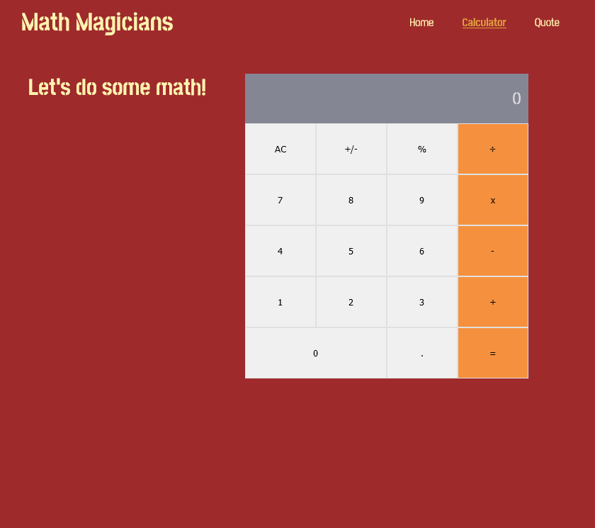

# Math magicians

> "Math magicians" is a website for all fans of mathematics. It is a Single Page App (SPA) that allows users to:

   - Make simple calculations.
   - Read a random math-related quote.




## Built With

- React


## Getting Started

To get a local copy up and running follow these simple example steps.

### Prerequisites

- Node.js
- npm

### Setup

Clone the repository with:

```
git clone git@github.com:ShinobiWarior/Math-magicians.git
```
or download [ZIP file](https://github.com/ShinobiWarior/Math-magicians/archive/refs/heads/dev.zip)

### Install
To install all dependencies run:
```
npm install
```
### Usage
To run it on the browser you can run in the project directory:

 ```
 npm start
 ```

## Run tests 
To test the project please run in the project directory:

```
npm test
```

## Author

👤👤 **Aleksandar Ivezic**

- GitHub: [@Aleksandar Ivezic](https://github.com/ShinobiWarior)
- Twitter: [@AIvezic](https://twitter.com/AIvezic)
- LinkedIn: [Aleksandar Ivezic](https://www.linkedin.com/in/aleksandar-ivezic/)

## 🤝 Contributing

Contributions, issues, and feature requests are welcome!

Feel free to check the [issues page](https://github.com/ShinobiWarior/Math-magicians/issues/).

## Show your support

Give a ⭐️ if you like this project!

## Acknowledgments

- This project was inspired by [Microverse](https://www.microverse.org/?grsf=w9rx3c)
